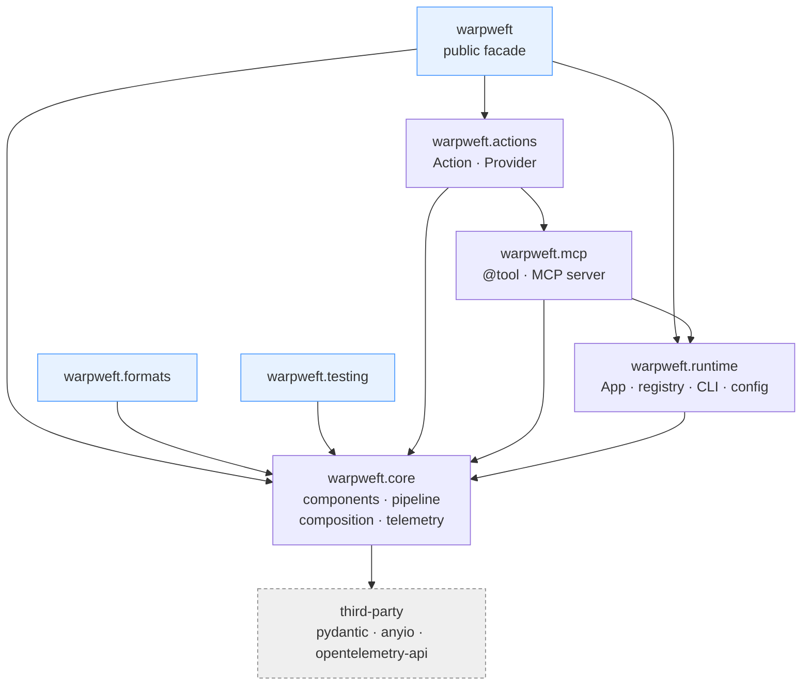

# Warpweft

A declarative framework for building **resilient, observable service
components** in async Python. You write a component's *calls*; warpweft wraps
every call with retry, timeout, circuit breaking, caching, concurrency limiting
and telemetry - driven by configuration, not boilerplate.

Async-only, built on [anyio](https://anyio.readthedocs.io/) (asyncio and trio).
Typed throughout (`mypy --strict`).

## Install

```bash
pip install warpweft          # core + runtime
pip install warpweft[mcp]     # + expose components as Model Context Protocol tools
pip install warpweft[yaml]    # + YAML config files
```

## A taste

```python
from warpweft import AComponent, App, component, invocable


@component
class Weather(AComponent[WeatherSettings, str, dict]):
    @invocable
    async def forecast(self, city: str) -> dict:
        resp = await self._client.get(f"/forecast/{city}")
        resp.raise_for_status()
        return resp.json()


app = App(
    env_prefix="MYAPP",
    config={"weather": {"policy": {"retry": {"attempts": 3, "base_delay": 0.1, "max_delay": 1.0}}}},
)

async with app.run():
    forecast = await app.proxy(Weather).forecast(city="oslo")  # runs through the chain
```

## How it fits together

Warpweft is layered: each package depends only on the ones beneath it, so the
engine never learns about its consumers. An arrow means **"depends on"**.



| Package | Role | Depends on |
| --- | --- | --- |
| **`warpweft.core`** | The engine: components and `@invocable` methods, the resilience pipeline (retry, timeout, circuit breaker, cache, concurrency, degradation), composition (registry, container, graph, health) and telemetry. Knows nothing about its consumers. | third-party only |
| **`warpweft.runtime`** | Turns a set of components into a running application: `App`, the default registry, `@component` autodiscovery, config sources and the `warpweft` CLI. | `core` |
| **`warpweft.mcp`** | Exposes invocables to LLMs as [Model Context Protocol](https://modelcontextprotocol.io/) tools. The `@tool` marker is pure Python; the server (needs the `mcp` extra) is imported lazily. | `core`, `runtime` |
| **`warpweft.actions`** | Ergonomic shapes over a component: an `Action` (one callable operation, auto-exposed as a tool) and a `Provider` (internal infrastructure). | `core`, `mcp` |
| **`warpweft`** (+ `warpweft.formats`, `warpweft.testing`) | Thin public facades re-exporting the surfaces above from one import path. | re-exports |

The direction is strict: `core` sits on third-party libraries alone, and higher
layers plug into it through generic extension points rather than the reverse. The
`mcp` server and YAML config are gated behind the `mcp` and `yaml` extras, so a
minimal install stays lean.

## Where to go next

- **[Write your first component](first-component.md)** - from nothing to a tested component.
- **Guides** - [Runtime](runtime.md), [Composition](composition.md),
  [Actions & providers](actions.md), [Field formats](formats.md),
  [Telemetry](telemetry.md), [Logging](logging.md), [MCP tools](mcp.md).
- **[API reference](reference/warpweft/index.md)** - generated from the source.

Everything useful is importable from `warpweft`; focused surfaces have their own
module - `warpweft.formats`, `warpweft.testing`, and `warpweft.mcp` (with the
extra). The internal layers remain available as `warpweft.core.*` and
`warpweft.runtime.*`.
